# Apsara Video Live Demo

## Summary
0. [Introduction](#introduction)
1. [Prerequisite](#prerequisite)
2. [Architecture](#architecture)
3. [Apsara Video Live configuration](#apsara-video-live-configuration)
4. [Apsara Video Live test](#apsara-video-live-test)
5. [Compiling and running the application locally](#compiling-and-running-the-application-locally)
6. [Cloud installation](#cloud-installation)
7. [Debugging](#debugging)
8. [Evolution](#evolution)
9. [Support](#support)

## Introduction
The goal of this demo is to showcase [Apsara Video Live](https://www.alibabacloud.com/product/apsaravideo-for-live),
an Alibaba Cloud service that allows users to broadcast video on internet.

This demo is composed of 3 pages:
* A home page that displays all the available streams.
* A broadcast page that allows a user to broadcast his webcam video on internet.
* A watch page that displays a selected video stream.

This demo doesn't require users to install any plugin: it uses WebRTC technology included in all modern web browsers.

## Prerequisite
Please [create an Alibaba Cloud account](https://www.alibabacloud.com/help/doc-detail/50482.htm) and
[obtain an access key id and secret](https://www.alibabacloud.com/help/faq-detail/63482.htm).

You also need to [buy a domain name](https://www.alibabacloud.com/domain) with Alibaba Cloud (e.g.
"my-sample-domain.xyz").

## Architecture
In order to design the architecture of this project, it is important to take on consideration two main constraints:
* The demo should not require users to install any plugin or tool on their computer. The web browser must be sufficient.
* Apsara Video Live expects [RTMP](https://en.wikipedia.org/wiki/Real-Time_Messaging_Protocol) for
  input streams, which is incompatible with standard web browser technologies such as HTML5.

Fortunately web browsers natively support a technology that allows users to send their webcam video on internet: 
[WebRTC](https://webrtc.org/). Thus, the chosen solution is to use WebRTC to lets users to broadcast their stream
to our server, then convert this data to RTMP in order to forward it to Apsara Video Live.

However establishing a WebRTC communication with a web browser and converting the video stream to RTMP is quite complex:
* A WebRTC gateway is necessary for the first part of the solution. For that we will choose
  [Janus](https://janus.conf.meetecho.com/), an open source server-side application that cans establish a WebRTC
  communication with web browsers and forward the video streams to another application via
  [RTP](https://developer.mozilla.org/en-US/docs/Web/API/WebRTC_API/Intro_to_RTP).
* In order to convert a RTP stream (from Janus) to RTMP, we will use [FFmpeg](https://www.ffmpeg.org/), a video
  conversion and streaming tool.
* In addition to Janus, we will need [Coturn](https://github.com/coturn/coturn), a
  [STUN / TURN server](https://www.html5rocks.com/en/tutorials/webrtc/infrastructure/#after-signaling-using-ice-to-cope-with-nats-and-firewalls)
  that allows users behind a firewall to use WebRTC.

The following diagram illustrates the architecture for this solution:


The blue arrows represent HTTP traffic. The orange arrows represent the audio + video data stream.

The complete flow to broadcast video stream from one user to others is the following:
0. A user, Alice, wants to broadcast video from her webcam and audio from her microphone. With a web browser,
   she navigates to the `BroadcastPage` and enters a name for her stream.
1. When she clicks on a start button, her web browser opens a HTTP connection to Janus, creates a "room" via
   the `videoroom plugin`, then starts sending audio + video stream to this room by using the RTP protocol. Note that
   Coturn is used to forward the RTP data stream from Alice to Janus in order to bypass Alice's firewall (Janus is
   unable to function properly without Coturn, even if it has a public IP address).
2. Once Alice's web browser is successfully transmitting audio + video data to Janus, this stream needs to be
   forwarded to the `Transcoding server`. Thus, her web browser contacts this `Transcoding server` (relayed via the
   web app server) in order to know which ports are available for this stream.
3. The `Transcoding server` chooses available ports for the RTP stream (4 ports in total, 2 for audio and 2 for video
   data) and sends back a response containing the ports and the IP address where to forward the stream (the IP address
   is useful in case you want to scale transcoding into multiple servers behind a
   [load balancer](https://www.alibabacloud.com/product/server-load-balancer)).
4. When Alice's web browser receives the response containing the ports and IP address of the `Transcoding server`,
   it sends a requests to Janus to let it forward the RTP stream to this destination.
5. Once Janus is successfully sending the RTP stream to the `Transcoding server`, Alice's web browser sends a
   request to the `Transcoding server` (relayed via the web app server) in order to start transcoding the audio + video
   stream to Apsara Video Live via the RTMP protocol.
6. Another user, Bob, wants to watch Alice's stream. With his web browser he navigates to the `HomePage` where
   he can have a list of all streams currently sent to Apsara Video Live (the web app server obtains this
   list of streams by contacting Apsara Video Live via the
   [Apsara Video Live SDK](https://github.com/aliyun/aliyun-openapi-java-sdk/tree/master/aliyun-java-sdk-live)).
   Bob then selects Alice's stream and navigates to the `WatchPage`.
7. Bob's web browser establishes a connection with Apsara Video Live via HTTP in order to receive audio and video
   stream in the [FLV format](https://en.wikipedia.org/wiki/Flash_Video) (the web application uses
   [Flv.js](https://github.com/Bilibili/flv.js/) to decode the stream in Javascript).

As you can see this solution is quite complex, and to that we need to add TLS certificate management for HTTPS,
[Cross-Origin Resource Sharing (CORS)](https://developer.mozilla.org/en-US/docs/Web/HTTP/CORS) configuration and
scaling.

Finally, now that the most critical part of the solution is decided, we choose the following technologies to build the
web application:
* [Spring Boot](https://spring.io/projects/spring-boot) for the backend.
* [React](https://reactjs.org/) and [Bootstrap](https://getbootstrap.com/) for the frontend.

### Apsara Video Live configuration
Before building the application, we need to register two domains in Apsara Video Live, one for sending data
(push domain), one for receiving (pull domain):
* Go to the [Apsara Video Live console](https://live.console.aliyun.com/);
* Click on the "Domains" left menu item;
* Click on the "Add Domain" button;
* Fill the form with the following parameters:
  * Domain Name = choose a sub-domain name such as "livevideo-push.my-sample-domain.xyz" with "push" in it
  * Live Center = the closest region the the users who will broadcast their video
  * Domain Type = Ingest Domain Name
  * CDN Accelerated Area = Outside Mainland China
* Click on the "Next" button;
* The new page should confirm that your domain name is created; click on "Back to Domain Name List".

Your domain should appear in the table:

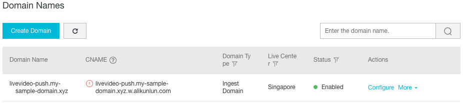

Redo the same operation to create a streaming domain name:
* Click on the "Add Domain" button;
* Fill the form with the following parameters:
  * Domain Name = choose a sub-domain name such as "livevideo-pull.my-sample-domain.xyz" with "pull" in it
  * Live Center = the closest region the the users who will watch the videos
  * Domain Type = Streaming Domain Name
  * CDN Accelerated Area = Outside Mainland China
* Click on the "Next" button;
* The new page should confirm that your domain name is created; click on "Back to Domain Name List".

You should now see your two domains:

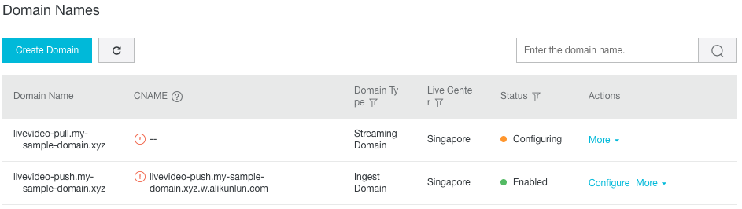

Let's configure the "push" domain:
* Copy the the CNAME corresponding to your "push" domain (e.g. livevideo-push.my-sample-domain.xyz.w.alikunlun.com);
* Go to the [Domain console](https://dc.console.aliyun.com);
* Next to your domain name (e.g. my-sample-domain.xyz), click on the "Resolve" link;
* Click on "Add Record";
* Fill the form with the following information:
  * Type: CNAME- Canonical name
  * Host: your "push" sub-domain (e.g. livevideo-push)
  * ISP Line: Outside Mainland China
  * Value: the CNAME you have just copied (e.g. livevideo-push.my-sample-domain.xyz.w.alikunlun.com)
  * TTL: 10 minute(s)
  * Synchronize the Default Line: checked
* Click on "OK";

Your DNS entries should look like this:

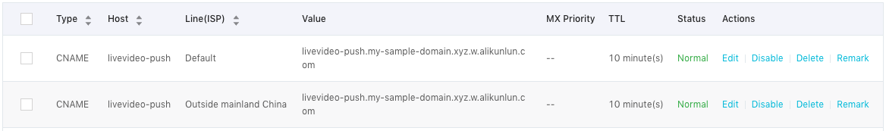

We can now configure the "pull" domain. Go back to your domain names list in the
[Apsara Video Live console](https://live.console.aliyun.com/). You should now have a CNAME entry next to your "pull"
domain:

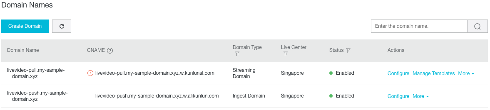

Copy this CNAME value (e.g. livevideo-pull.my-sample-domain.xyz.w.kunlunsl.com) and go back to the
[Domain console](https://dc.console.aliyun.com):
* Next to your domain name (e.g. my-sample-domain.xyz), click on the "Resolve" link;
* Click on "Add Record";
* Fill the form with the following information:
  * Type: CNAME- Canonical name
  * Host: your "pull" sub-domain (e.g. livevideo-pull)
  * ISP Line: Outside Mainland China
  * Value: the CNAME you have just copied (e.g. livevideo-pull.my-sample-domain.xyz.w.kunlunsl.com)
  * TTL: 10 minute(s)
  * Synchronize the Default Line: checked
* Click on "OK";

Your DNS entries should be similar to this:

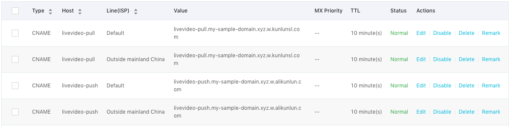

We now need to link the "push" and "pull" domains together:
* Go back to your domain names list in the [Apsara Video Live console](https://live.console.aliyun.com/);
* Next to your "pull" domain, click on the "Domain Settings" link;
* In the new page, go to the "Stream Ingest Information" tab and click on the button "Add Stream Ingest Information";
* In the popup, select your "push" domain (e.g. livevideo-push.my-sample-domain.xyz) and click on "OK".

Finally, we need to add some HTTP header configuration in order to solve
[CORS problems](https://developer.mozilla.org/en-US/docs/Web/HTTP/CORS):
* Go back to your domain names list in the [Apsara Video Live console](https://live.console.aliyun.com/);
* Next to your "pull" domain, click on the "Domain Settings" link;
* In the new page, click on the "HTTP Header Settings" left menu item;
* Click on the "Add" button; in the new popup, select the `Access-Control-Allow-Origin` header, and set the value `*`;
* Click on OK to confirm; the configuration should look like this:

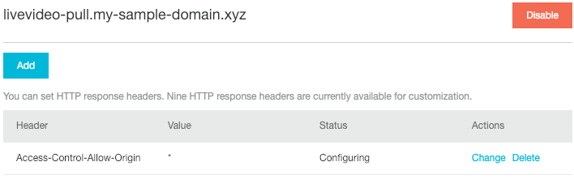

## Apsara Video Live test
We can test this configuration by using [Open Broadcaster Software (OBS)](https://obsproject.com/download), a free
and open source software for video recording and live streaming. Download and install this application to your
computer.

Before configuring OBS we need to get an URL where to send the video stream:
* Go to the [Apsara Video Live console](https://live.console.aliyun.com/);
* Click on the "Domains" left menu item;
* Click on your push domain name (e.g. "livevideo-push.my-sample-domain.xyz");
* Click on the "Access Control" left menu item.

You should get a page similar to this screenshot:

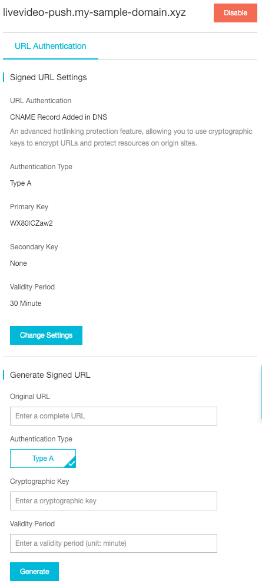

This page is in fact composed of two independent sections:
* "Signed URL Settings" that displays all information to authenticate the stream sender;
* "Generate Signed URL" that allow you to generate an RTMP URL with a valid authentication token.

Go to the second section and fill the form in the following way:
* Original URL = rtmp://your-push-domain/sample-app/sample-stream
  (e.g. "rtmp://livevideo-push.my-sample-domain.xyz/sample-app/sample-stream")
* Cryptographic Key = copy-paste the "Primary Key" field value from the "Signed URL Settings" section above
* Validity Period = 30

Click on the "Generate" button to obtain an URL. As you can see on the following screenshot, the URL is:
```
rtmp://livevideo-push.my-sample-domain.xyz/sample-app/sample-stream?auth_key=1546482883-0-0-7c5a077514e3a8e6913a8234e8b88976
```
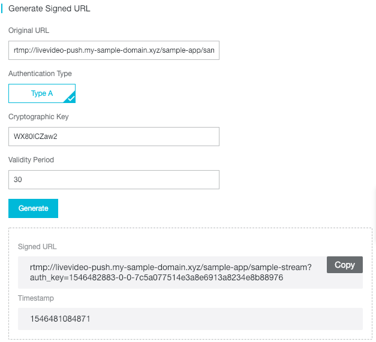

Now execute OBS on your computer and configure it in the following way:
* Configure one scene with one "Video Capture Device" source and select your webcam (note the resolution of your
  webcam, for example 1280x720);
  
  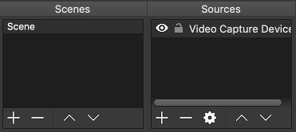
  
  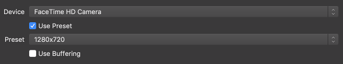
  
* Go to the "Settings" and go to the "Video" tab; set the "Base (Canvas) Resolution" and "Output (Canvas) Resolution"
  to the same value as your webcam (e.g. 1280x720);
  
  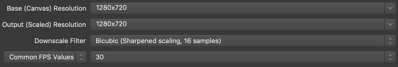
  
* Still in the "Settings" window, go to the "Stream" tab; fill the form with the following values:
  * Stream Type = Custom Streaming Server
  * URL = your push URL truncated after "sample-app/" (e.g. "rtmp://livevideo-push.my-sample-domain.xyz/sample-app/")
  * Stream key = the rest of the push URL
    (e.g. "sample-stream?auth_key=1546482883-0-0-7c5a077514e3a8e6913a8234e8b88976")
  * Use authentication = unchecked
  
  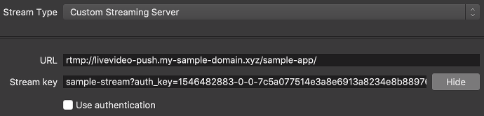

Click on the "OK" button to save your settings, then click on the "Start Streaming" button. After few seconds
the status bar at the bottom of OBS should look like this:

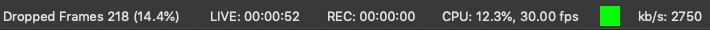

Keep OBS running in the background. With your web browser, go back to the
[Apsara Video Live console](https://live.console.aliyun.com/):
* Click on the "Stream Management > Ingest Endpoints" menu item; you should be able to see your "sample-stream":

  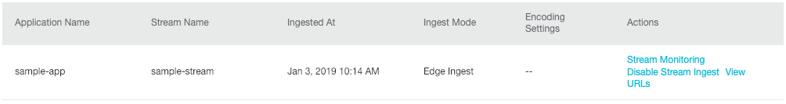

* Click on the "View URLs" link on the right of your "sample-stream"; you should b able to see three URLs:

  

* Put your mouse cursor on top of the first URL: two links should appear, "Copy" and "Play"; click on "Play";
* A new popup should appear. If you use Google Chrome, you will need to click to enable "Adobe Flash Player";

Congratulation if you can see yourself! It means the Apsara Video Live configuration is correct.

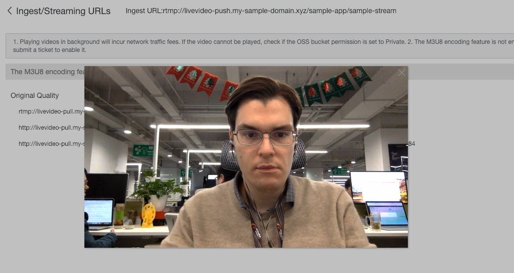

## Compiling and running the application locally
Please install [Java JDK 11+](https://adoptopenjdk.net/installation.html?variant=openjdk11&jvmVariant=hotspot) and
[Maven 3.6.x+](https://maven.apache.org/install.html) on your computer.

Before we can compile and run the web application, we first need to install and execute Janus and Coturn. Open a
terminal and type the following commands:
```bash
# Go to a folder where you want to setup Janus and Coturn
cd ~/tools
```
If you are using Ubuntu Linux, you need to install the following dependencies:
```bash
apt-get install libmicrohttpd-dev libjansson-dev libnice-dev \
    libssl-dev libsrtp-dev libsofia-sip-ua-dev libglib2.0-dev \
    libopus-dev libogg-dev libcurl4-openssl-dev liblua5.3-dev \
    pkg-config gengetopt libtool automake libcurl4-openssl-dev
    
wget https://github.com/cisco/libsrtp/archive/v2.2.0.zip
unzip v2.2.0.zip
cd libsrtp-2.2.0
./configure
make
sudo make install
cd ..
```
If you are using Mac OSX, you need to install the following dependencies:
```bash
brew install jansson libnice openssl srtp libusrsctp libmicrohttpd \
    libwebsockets cmake rabbitmq-c sofia-sip opus libogg curl glib \
    libconfig pkg-config gengetopt autoconf automake libtool
```
We can now download and compile Janus:
```bash
# Download Janus
wget https://github.com/meetecho/janus-gateway/archive/v0.4.2.zip
unzip v0.4.2.zip
cd janus-gateway-0.4.2

# Compile Janus
sh autogen.sh
./configure --disable-websockets --disable-data-channels --disable-rabbitmq --disable-mqtt --disable-plugin-audiobridge
make
sudo make install
sudo make configs
cd ..
```
Note: if you use Mac OSX, you might need to replace the `./configure` command with the following one:
```bash
./configure --disable-websockets --disable-data-channels --disable-rabbitmq --disable-mqtt \
    --disable-plugin-audiobridge --prefix=/usr/local/janus PKG_CONFIG_PATH=/usr/local/opt/openssl/lib/pkgconfig
```
Check you Janus configuration with the following command:
```bash
janus --version
```
It should output something like this:
```
Janus commit: not-a-git-repo
Compiled on:  Fri Dec 28 15:30:01 CST 2018

janus 0.4.2
```
Start Janus with the following command:
```bash
janus
```

Let's continue with Coturn. If you are using Ubuntu Linux, run:
```bash
apt-get install coturn
```
If you are using Mac OSX, run:
```bash
brew install coturn
```
Coturn needs to be configured. If you are using Ubuntu Linux, edit the file "/etc/default/coturn", find the
following line and uncomment it by removing '#' symbol:
```
#TURNSERVER_ENABLED=1
```
Note: this operation above is not necessary on Mac OSX.

Edit the main Coturn configuration file: on Ubuntu Linux the file is located at "/etc/turnserver.conf"; on MacOSX
the file is located at "/usr/local/Cellar/coturn/4.5.0.7/etc/turnserver.conf.default":
* Uncomment "#fingerprint"
* Add a line "user=livevideo:LivevideoPassword2018"
* Add a line "external-ip=30.43.48.75/127.0.0.1" where "30.43.48.75" is the machine private IP address
* Add a line "server-name=localhost"
* Add a line "realm=localhost"

Start Coturn with the following command:
```bash
turnserver -c /etc/turnserver.conf -v
```

Check that your system has FFMPEG version 4.x+:
```bash
# Check ffmpeg version
ffmpeg
```
If your system doesn't have FFMPEG or has an old version, you need to install it:
* On Ubuntu Linux, you can install FFMPEG with the following commands:

```bash
sudo add-apt-repository ppa:jonathonf/ffmpeg-4
sudo apt-get update
sudo apt-get install ffmpeg
```
* On Mac OSX, you can install FFMPEG with the following commands:

```bash
brew install ffmpeg
```

Download this repository on your computer, open the file "transcoder/src/main/resources/application.properties":
```properties
# Web server port
server.port=8090

# Folder where SDP files are saved. Their goal is to tell FFMPEG some information about the RTP stream, such as
# the ports, codecs, etc.
transcoding.ffmpegSdpFileFolderPath=/tmp

# Path to the FFMPEG executable
transcoding.ffmpegExecutablePath=/usr/local/Cellar/ffmpeg/4.1_1/bin/ffmpeg

# Port ranges available for RTP data
transcoding.rtpPortRangeStart=30000
transcoding.rtpPortRangeEnd=50000
transcoding.unusedPortTimeoutMillis=120000
```
Change the value of the property `transcoding.ffmpegExecutablePath` to where ffmpeg is installed on your system.

Edit the file "webapp/src/main/resources/application.properties":
```properties
# Janus (WebRTC Gateway) configuration
janus.hostname=localhost
janus.httpPort=8088
janus.httpsPort=8089
janus.httpPath=/janus

# STUN/TURN server configuration
turnServer.url=turn:localhost:3478
turnServer.username=livevideo
turnServer.password=LivevideoPassword2018

# Transcoder configuration (note: HTTP and HTTPS ports use TCP whereas the ones for audio and video use UDP)
transcoder.hostname=localhost
transcoder.httpPort=8090

# Apsara Video Live
apsaraVideoLive.accessKeyId=your-access-key-id
apsaraVideoLive.accessKeySecret=your-access-key-secret
apsaraVideoLive.regionId=ap-southeast-1
apsaraVideoLive.pullDomainName=livevideo-pull.my-sample-domain.xyz
apsaraVideoLive.pushDomainName=livevideo-push.my-sample-domain.xyz
apsaraVideoLive.appName=livevideo
apsaraVideoLive.pushAuthPrimaryKey=WX80lCZaw2
apsaraVideoLive.pushAuthValidityPeriod=1800
apsaraVideoLive.pullAuthPrimaryKey=0hBanJ7P97
apsaraVideoLive.pullAuthValidityPeriod=1800
```
Apply the following changes in this file:
* Set your access key id and secret into `apsaraVideoLive.accessKeyId` and `apsaraVideoLive.accessKeySecret`.
* If necessary, change the region ID (you can find your closest region ID in
  [this document](https://www.alibabacloud.com/help/doc-detail/40654.htm)).
* Set your pull and push domain names in `apsaraVideoLive.pullDomainName` and `apsaraVideoLive.pushDomainName`.
* Set the `apsaraVideoLive.pullAuthPrimaryKey` and `apsaraVideoLive.pushAuthPrimaryKey` with the "Primary Key" values
  provided by the [Apsara Video Live console](https://live.console.aliyun.com/) (go to "Domains", select your pull
  domain first, go to "Access Control", select the "URL Authentication" tab, copy the "Primary Key", then go back to
  the "Domains" page, select the push domain, go to "Access Control" and copy the "Primary Key").

We can finally compile and launch the web application! Open a terminal and type:
```bash
# Navigate to the location where you have downloaded this project
cd ~/projects/apsara-video-live-demo

# Compile the application
mvn clean install
```
The compilation needs several minutes to complete (Maven needs to download the dependencies for the backend and
frontend). The result should look like this:
```
[INFO] ------------------------------------------------------------------------
[INFO] Reactor Summary:
[INFO] 
[INFO] apsara-video-live-demo 1.0.0 ....................... SUCCESS [  0.342 s]
[INFO] apsara-video-live-demo-commons ..................... SUCCESS [  1.503 s]
[INFO] apsara-video-live-demo-webapp ...................... SUCCESS [ 18.525 s]
[INFO] apsara-video-live-demo-transcoder 1.0.0 ............ SUCCESS [  0.582 s]
[INFO] ------------------------------------------------------------------------
[INFO] BUILD SUCCESS
[INFO] ------------------------------------------------------------------------
[INFO] Total time: 21.653 s
[INFO] Finished at: 2019-01-03T10:46:56+08:00
[INFO] ------------------------------------------------------------------------
```
You can now start the "Transcoding server":
```bash
cd transcoder
mvn spring-boot:run
```
The server should start and print the logs:
```
2019-01-03 11:37:12.073  INFO 15958 --- [           main] o.s.b.w.embedded.tomcat.TomcatWebServer  : Tomcat started on port(s): 8090 (http) with context path ''
2019-01-03 11:37:12.081  INFO 15958 --- [           main] c.a.i.livevideotranscoder.Application    : Started Application in 2.149 seconds (JVM running for 5.525)
```
Open another terminal and execute the main web application server:
```bash
# Navigate to the location where you have downloaded this project
cd ~/projects/apsara-video-live-demo

cd webapp
mvn spring-boot:run
```
The server should start and print the logs:
```
2019-01-03 11:39:03.326  INFO 16025 --- [           main] o.s.b.w.embedded.tomcat.TomcatWebServer  : Tomcat started on port(s): 8080 (http) with context path ''
2019-01-03 11:39:03.332  INFO 16025 --- [           main] com.alibaba.intl.livevideo.Application   : Started Application in 2.142 seconds (JVM running for 15.699)
```

Open [Firefox](https://www.mozilla.org/en-US/firefox/), install the
[CORS Everywhere add-on](https://addons.mozilla.org/en-US/firefox/addon/cors-everywhere/), click on the icon of
this add-on to disable CORS check for all websites, and navigate to "http://localhost:8080":

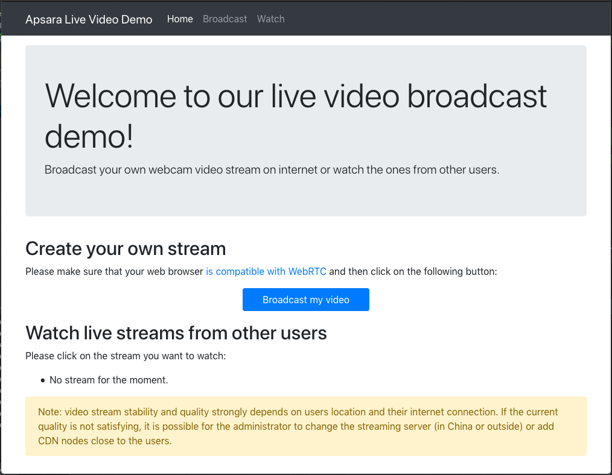

Click on the "Broadcast my video" button, choose a name for your stream and click on the "Start" button. The broadcast
page should look like this:

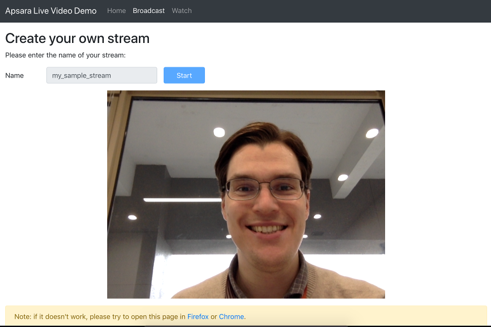

In another Firefox tab, open "http://localhost:8080" and look at the available streams:

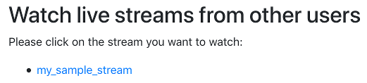

Click on the stream. You should be able to watch the video:


## Cloud installation
Installing and configuring all the servers is a complex operation. In order to makes things simpler we will use
[Terraform](https://www.terraform.io/) to create and configure cloud resources.
Please [install Terraform](https://learn.hashicorp.com/terraform/getting-started/install.html) on your computer.

Open a terminal on your computer and execute the following commands:
```bash
# Navigate to the location where you have downloaded this project
cd ~/projects/apsara-video-live-demo

# Configure the Terraform scripts
export ALICLOUD_ACCESS_KEY="your-accesskey-id"
export ALICLOUD_SECRET_KEY="your-accesskey-secret"
export ALICLOUD_REGION="your-region-id"

# Top domain name
export TF_VAR_domain_name="my-sample-domain.xyz"
# Sub-domain name for the server that transcodes RTP streams to RTMP for Apsara Video Live
export TF_VAR_transcoder_sub_domain_name="livevideo-transcoder"
# Sub-domain name for the TURN / STUN server that allows users to bypass NAT firewalls for WebRTC
export TF_VAR_turnstun_sub_domain_name="livevideo-turnstun"
# Sub-domain name for the WebRTC gateway
export TF_VAR_webrtcgw_sub_domain_name="livevideo-webrtcgw"
# Sub-domain name for the web application
export TF_VAR_webapp_sub_domain_name="livevideo"
# Sub-domain name for the certificate manager, see the notes below this code block
export TF_VAR_certman_sub_domain_name="livevideo-certman"
# Root password for all ECS instances
export TF_VAR_ecs_root_password="YourR00tPassword"
# Username for TURN / STUN server authentication
export TF_VAR_turn_user="livevideo"
# Password for TURN / STUN server authentication
export TF_VAR_turn_password="YourTurnPassw0rd"
# Access key ID of an user that can access to Apsara Video Live
export TF_VAR_apsaravideolive_user_accesskey_id="${ALICLOUD_ACCESS_KEY}"
# Access key secret of a an user that can access to Apsara Video Live
export TF_VAR_apsaravideolive_user_accesskey_secret="${ALICLOUD_SECRET_KEY}"
# Region where we use the Apsara Video Live service
export TF_VAR_apsaravideolive_region_id="${ALICLOUD_REGION}"
# Push domain registered into Apsara Video Live
export TF_VAR_apsaravideolive_push_domain="livevideo-push.my-sample-domain.xyz"
# Pull domain registered into Apsara Video Live
export TF_VAR_apsaravideolive_pull_domain="livevideo-pull.my-sample-domain.xyz"
# Top part of the pull domain
export TF_VAR_apsaravideolive_pull_top_domain_name="${TF_VAR_domain_name}"
# sub part of the pull domain
export TF_VAR_apsaravideolive_pull_sub_domain_name="livevideo-pull"
# Unique name that would allow multiple applications to share the same domain in Apsara Video Live
export TF_VAR_apsaravideolive_app_name="livevideo"
# Primary key associated with the push domain in Apsara Video Live
export TF_VAR_apsaravideolive_push_auth_primary_key="push-primary-key"
# Auth key validity period associated with the push domain in Apsara Video Live
export TF_VAR_apsaravideolive_push_auth_validity_period=1800
# Primary key associated with the pull domain in Apsara Video Live
export TF_VAR_apsaravideolive_pull_auth_primary_key="pull-primary-key"
# Auth key validity period associated with the pull domain in Apsara Video Live
export TF_VAR_apsaravideolive_pull_auth_validity_period=1800
# Email address that will receive notifications when TLS / SSL certificates are going to expire
export TF_VAR_lets_encrypt_email_address="your.email@example.net"
# Access key ID of a user that can have access to the DNS and CDN OpenAPI
export TF_VAR_api_user_accesskey_id="${ALICLOUD_ACCESS_KEY}"
# Access key secret of a user that can have access to the DNS and CDN OpenAPI
export TF_VAR_api_user_accesskey_secret="${ALICLOUD_SECRET_KEY}"
# Region where the domain has been registered
export TF_VAR_api_region_id="${ALICLOUD_REGION}"

# Build the base infrastructure
cd infrastructure/00_base
terraform init
terraform apply

# Build the transcoder infrastructure
cd ../05_transcoder
terraform init
terraform apply

# Build the TURN / STUN server infrastructure
cd ../10_turn_stun_server
terraform init
terraform apply

# Build the WebRTC gateway infrastructure
cd ../15_webrtc_gateway
terraform init
terraform apply

# Build the web application infrastructure
cd ../20_webapp
terraform init
terraform apply

# Build the Apsara Video Live pull domain certificate manager infrastructure
cd ../25_avl_certman
terraform init
terraform apply
```

This script requires many parameters to be stored in environment variables:
* `TF_VAR_domain_name` must contain the domain you must have purchased before starting this demo (see the
  [Prerequisite section](#prerequisite)).
* `TF_VAR_*_sub_domain_name` values can be set to anything. The most important one is `TF_VAR_webapp_sub_domain_name`;
  for example if you set it to "livevideo", then your web application will be available at the URL
  "https://livevideo.my-sample-domain.xyz".
* `TF_VAR_ecs_root_password`, `TF_VAR_turn_user` and `TF_VAR_turn_password` can be set to anything. Just choose
  hard-to-guess passwords.
* `TF_VAR_apsaravideolive_user_accesskey_id` and `TF_VAR_apsaravideolive_user_accesskey_secret` can be related to a
  normal user, or from a RAM user with the "AliyunLiveFullAccess" permission.
* `TF_VAR_apsaravideolive_*_domain*` must be set to the domains you have registered in the
  [Apsara Video Live configuration](#apsara-video-live-configuration) section.
* `TF_VAR_apsaravideolive_app_name` can be set to anything in the format `a-zA-Z0-9_-`.
* `TF_VAR_apsaravideolive_*_auth_primary_key` and `TF_VAR_apsaravideolive_*_auth_validity_period` must contain the
  primary key and validity period for authentication. You must have used them in the
  [Apsara Video Live test](#apsara-video-live-test) section.
* We use [Let’s Encrypt](https://letsencrypt.org/) to obtain TLS / SSL certificates in order to support HTTPS.
  `TF_VAR_lets_encrypt_email_address` must contain an email address where notifications are sent when the
  certificates are going to expire.
* `TF_VAR_api_user_*` are used to invoke [OpenAPI](https://api.aliyun.com/) in order to update the
  TLS / SSL certificate for the pull domain on the CDN-side. It can be related to a normal user or RAM user
  allowed to access DNS and CDN APIs.

Note: the "Apsara Video Live pull domain certificate manager" is a small ECS instance in charge of automatically
obtaining and updating the Apsara Video Live TLS/SSL certificate.

You can test the web application by browsing to its URL (e.g. https://livevideo.my-sample-domain.xyz).

## Debugging
This demo involves a lot of elements that can break, this section explains how to quickly find problems.

In order to debug the full process, we will open two web browser tabs: one for broadcasting video, one to play it:
* Open a web browser tab with the application (e.g. https://livevideo.my-sample-domain.xyz) and click on the
  "Broadcast my video" button.
* Open the [web developer console](https://developer.mozilla.org/en-US/docs/Tools/Web_Console/Opening_the_Web_Console),
  this allows us to see frontend logs.
* Set a stream name and click on the "Start" button. Many logs are displayed in the web developer console: usually
  connection errors can be easily found there.
* Open another web browser tab and go to the application (e.g. https://livevideo.my-sample-domain.xyz). You should
  normally see your stream.

If you cannot see your stream it means that the problem has great chances to be located on the broadcasting part,
which is the most complex one.

If you can see your stream, then there are great chances that the problem comes from the video playback part. Open the
[web developer console](https://developer.mozilla.org/en-US/docs/Tools/Web_Console/Opening_the_Web_Console) and click
on the stream name: if the video is not displayed, check the logs printed in the web developer console, they should
contain the errors.

When the error comes from the broadcasting part, we should check if the video stream reaches Apsara Video Live:
* Go to the [Apsara Video Live console](https://live.console.aliyun.com/).
* On the left menu, click on the "Stream Management > Ingest Endpoints" item. All the current streams should be
  displayed there.
  
If your stream is missing, it means that the problem should come from an earlier step in the broadcasting process (the
video stream doesn't reach Apsara Video Live). On the other hand, if the stream is present, you can click on it and
try to play it from the [Apsara Video Live console](https://live.console.aliyun.com/). Usually when the stream is
present but you can't read it, it means that there is a problem on the video playback part, which can be due to bad
network: in this case you can try again from a different computer, like an ECS instance located in the region where
Apsara Video Live center is located (use [VNC](https://en.wikipedia.org/wiki/Virtual_Network_Computing) to access to
this ECS instance).

The element right before Apsara Video Live is the transcoding server. Let's check the logs, open a terminal on your
computer an connect to this server via SSH:
```bash
# Connect to the transcoding server
ssh root@livevideo-transcoder.my-sample-domain.xyz

# Check that both Nginx and the transcoder are running
systemctl | grep nginx
systemctl | grep transcoder
```
Both of them should have the `running` status. To check the logs of the services use the following commands:
```bash
# Check the logs of nginx
journalctl --unit=nginx
cat /var/log/nginx/error.log

# Check the logs of the transcoder
journalctl --unit=transcoder
```
These logs usually contain clear error messages that allows us to spot a problem if any.

Problems can also arise at upper layers. Here is how to check other servers logs:
* For Janus (WebRTC Gateway):
```bash
# Connect to the server
ssh root@livevideo-webrtcgw.my-sample-domain.xyz

# Check Janus logs
journalctl --unit=janus
```
* For Coturn (STUN / TURN server):
```bash
# Connect to the server
ssh root@livevideo-turnstun.my-sample-domain.xyz

# Check Coturn logs
journalctl --unit=coturn
cat /var/log/turn_*.log
```
* For the web application backend:
```bash
# Connect to the server
ssh root@livevideo.my-sample-domain.xyz

# Check the logs
journalctl --unit=webapp
```
* For the certificate manager:
```bash
# Connect to the server
ssh root@livevideo-certman.my-sample-domain.xyz

# Check the logs
journalctl --unit=certificate-updater
```

## Evolution
TODO: scaling.

## Support
Don't hesitate to [contact us](mailto:projectdelivery@alibabacloud.com) if you have questions or remarks.